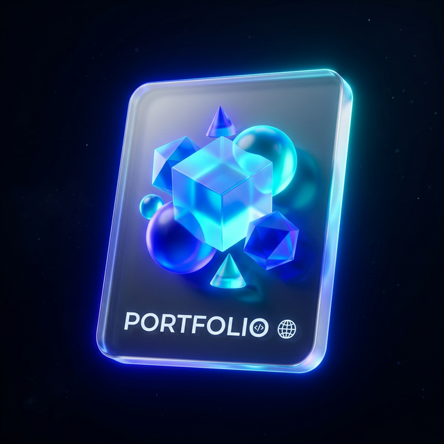
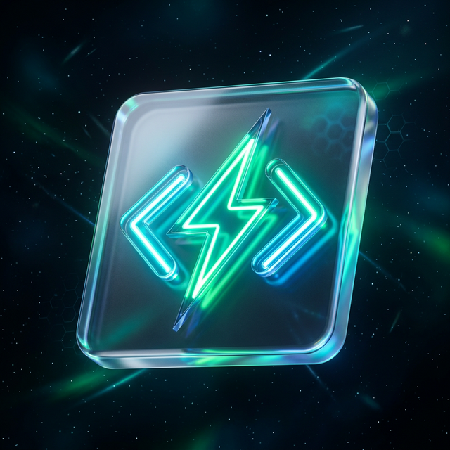
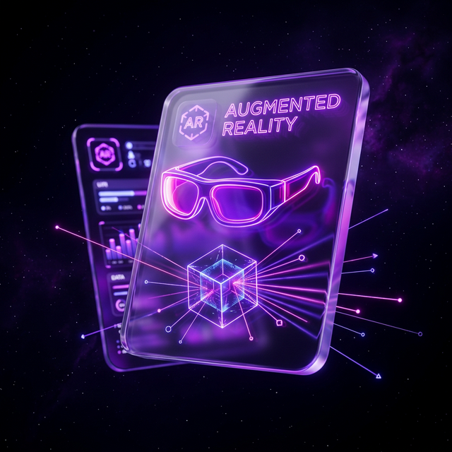
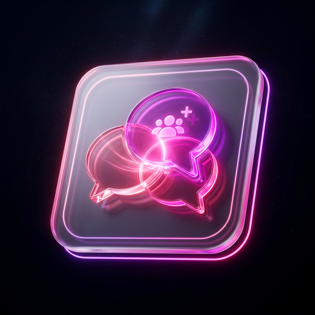

<!-- ██████████████████ HEADER ██████████████████ -->

<!-- ████████████████ TYPING ANIMATION ████████████████ -->

  

<!-- ████████████████ PROFILE BADGES (RESET VISITOR COUNT) ████████████████ -->

&nbsp;&nbsp;

 

<!-- ████████████████ ABOUT ME ████████████████ -->
<h2 align="center"> 🚀 About Me </h2>

- 🔭 **Currently working on** — Full-stack web apps and personal projects that solve real-world problems
- 🌱 **Currently learning** — Advanced system design, cloud deployment, and modern frameworks
- 👯 **Looking to collaborate on** — Meaningful open-source projects and freelance opportunities
- 🤝 **Looking for help with** — Connecting with clients and teams who need a reliable full-stack cloud developer
- 💬 **Ask me about** — Building scalable web apps, picking the right tech stack, or full-stack dev
- ⚡ **Fun fact** — I debug best with coffee and lo-fi music in the background

 

<!-- ████████████████ FEATURED PROJECTS ████████████████ -->
<h2 align="center"> 💻 Featured Projects </h2>

<table width="100%" style="border-collapse: collapse;">
  <tr>
    <td width="48%" align="center" style="padding: 20px; background-color: #040914; border-radius: 20px; border: 1px solid #1565C0;">
      
        
      <h3 style="color: #90CAF9;">✨ Immersive 3D Portfolio</h3>
      
Interactive portfolio with <strong>3D Spline graphics</strong>, <strong>GSAP</strong> and SSR

        
      
      
    </td>
    <td width="4%" style="border: none;"></td>
    <td width="48%" align="center" style="padding: 20px; background-color: #040914; border-radius: 20px; border: 1px solid #1565C0;">
      
        
      <h3 style="color: #90CAF9;">⚡ CodeForge</h3>
      
Real-time <strong>collaborative IDE</strong> with multi-language execution

        
      
    </td>
  </tr>
  <tr style="height: 20px;"><td colspan="3"></td></tr>
  <tr>
    <td width="48%" align="center" style="padding: 20px; background-color: #040914; border-radius: 20px; border: 1px solid #1565C0;">
      
        
      <h3 style="color: #90CAF9;">🥽 AR Visualizer</h3>
      
Browser-based <strong>Augmented Reality</strong> platform for 3D models

        
      
      
    </td>
    <td width="4%" style="border: none;"></td>
    <td width="48%" align="center" style="padding: 20px; background-color: #040914; border-radius: 20px; border: 1px solid #1565C0;">
      
        
      <h3 style="color: #90CAF9;">📅 Event Manager</h3>
      
Event platform with <strong>Firebase Real-time DB</strong> &amp; authentication

        
      
      
    </td>
  </tr>
  <tr style="height: 20px;"><td colspan="3"></td></tr>
  <tr>
    <td colspan="3" align="center" style="padding: 20px; background-color: #040914; border-radius: 20px; border: 1px solid #1565C0;">
      
        
      <h3 style="color: #90CAF9;">💬 Community Chat</h3>
      
Real-time chat platform with live <strong>WebSocket</strong> communication

        
      
      
    </td>
  </tr>
</table>

 

<!-- ████████████████ TECH STACK ████████████████ -->
<h2 align="center"> 🛠️ Technology Stack </h2>

    
    
  

 

<!-- ████████████████ GITHUB STATS ████████████████ -->
<h2 align="center"> 📊 GitHub Analytics </h2>

  

 

  
  &nbsp;&nbsp;
  

 

<!-- ████████████████ CONTRIBUTION ████████████████ -->
<h2 align="center"> 🐍 Core Contributions </h2>

  <picture>
    <source media="(prefers-color-scheme: dark)" srcset="https://raw.githubusercontent.com/Kathari-Hima-Kishore/Kathari-Hima-Kishore/main/dist/github-contribution-grid-snake-dark.svg">
    <source media="(prefers-color-scheme: light)" srcset="https://raw.githubusercontent.com/Kathari-Hima-Kishore/Kathari-Hima-Kishore/main/dist/github-contribution-grid-snake.svg">
    
  </picture>

 

<!-- ████████████████ CONNECT WITH ME ████████████████ -->
<h2 align="center"> 🌐 Connect With Me </h2>

  
  &nbsp;&nbsp;
  
  &nbsp;&nbsp;
  

 

<!-- ████████████████ FOOTER ████████████████ -->

